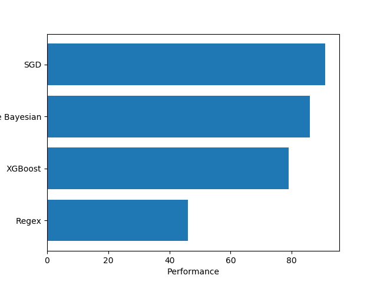

# Projekt Klasyfikacja tekstów
## Temat: Klasyfikacja tematów artykułów

### 1. Dane wejściowe
Bazą do uczenia modeli jest baza artykułów pobrana przy pomocy biblioteki nltk zawierająca 20 tysięcy artukółów prasowych podzielonych na 20 kategorii tematycznych.

### 2. Przygotowanie tekstu
Każdy z artykułów przechodzi serię transformacji aby jak najłatwiej można było przeanalizować najważniejsze informację na jego temat. Każde słowo w artykule zostaje przefiltrowane pod kątem długości, słowa krótsze niż 3 znaki zostają usunięte z tekstu, następnie aby zminimalizować zróżnicowanie w całym tekscie wielkie litery zostają zamienione na małe oraz tekst zostaje poddany lemmatyzacji. Możliwa jest także stemizacja tekstu, ale nie przynosi ona żadnych pozytywnych efektów.

### 3. Wektoryzacja tekstu
Z racji, że modele nie operują na stringach należy tekst reprezentować w formie liczbowej.
W projekcie został użyty wektoryzator TFIDF który kademu słowu w tekscie przypisuje wartość wyliczoną na podstawie stosunku liczby wystąpień słowa w tekście i liczby słów w  tekście oraz częstotliowści występowania słowa w zbiorze tekstów.

### 4. Modele
* Naiwny model Bayesiański polegający na użyciu prostego wzoru probalistycznego zakładający brak silnych korelacji pomiędzy danymi.
* Model SGD który implementuje znormalizowany model liniowy ze stochastycznym gradientem zniżania
* Model XGBoost implementujący wiele losowych drzew decyzyjnych
* Autorski model regex polegający na wyszukaniu najczęściej występujących słów w danej kategorii i kategoryzacji na podstawie najwyższej częstotliowści występowania tych słów

### 5. Wyniki

Najwyższą sprawność osiągną model SGD, następnie Bayesiański i XGBoost, model regexowy miał sprawność porównywalną do rzutu monetą.
### 6. Słownik
* Lemmatyzacja - sprowadzanie różnych odmian jednego słowa do jednej, wspólnej formy
* Stemmizacja - usuwanie końcówek słów w celu sprowadzenia różnych ich odmian do wspólnej formy
* Wektoryzacja - zamiana tekstu na zbiór indeksów słów i przypisanie im pewnej wartości umożliwiająć wyróżnienie mniej i bardziej istotnych słów
